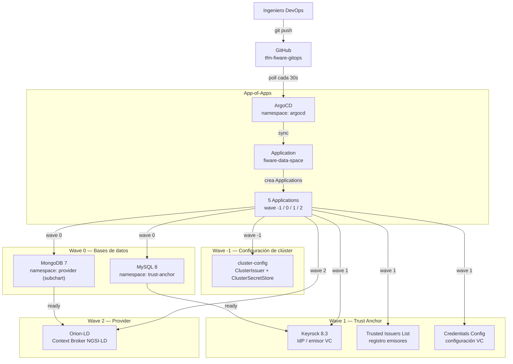

# Diagramas y Evidencias — Guía de Extracción

Este archivo describe cada diagrama e imagen que debe incluirse en la memoria, con instrucciones exactas para generarlos o capturarlos.

---

## DIAGRAMAS A CREAR (draw.io / PlantUML)

Estos diagramas se crean manualmente y se exportan como PNG para insertar en la memoria.

### D1 — Figura 2.1: Modelo de datos NGSI-LD

**Sección:** §2.2.1  
**Descripción:** Estructura de una entidad NGSI-LD con sus tres tipos de atributos (Property, Relationship, GeoProperty).  
**Herramienta:** draw.io  
**Contenido:** Caja central "Entidad" con tres ramas: Property (valor primitivo), Relationship (apunta a otra entidad), GeoProperty (coordenadas GeoJSON).

---

### D2 — Figura 4.1: Diagrama C4 Level 1 (Contexto)

**Sección:** §4.2  
**Descripción:** Vista de contexto del sistema con actores y sistemas externos.  
**Herramienta:** draw.io (template C4)  
**Elementos:**
- Actor: Ingeniero DevOps → GitHub (git push)
- Actor: Consumidor de Datos → Sistema (API NGSI-LD)
- Actor: Proveedor de Datos → Sistema (publica entidades)
- Sistema externo: GitHub (Single Source of Truth)
- Sistema externo: iSHARE Satellite (ancla de confianza)

---

### D3 — Figura 4.2: Diagrama C4 Level 2 (Contenedores)

**Sección:** §4.3  
**Descripción:** Vista de contenedores mostrando los cuatro namespaces Kubernetes y sus componentes.  
**Herramienta:** draw.io  
**Elementos:**
- Namespace `argocd`: ArgoCD server, controller, repo-server, redis
- Namespace `trust-anchor`: Keyrock, TIL, CCS, MySQL
- Namespace `provider`: Orion-LD, Kong, MongoDB
- Namespace `platform`: cert-manager, ESO, ingress-nginx

---

### D4 — Figura 4.3: Topología de Red AWS

**Sección:** §4.4  
**Descripción:** VPC `10.0.0.0/16` en tres capas con recursos AWS.  
**Herramienta:** draw.io (AWS shape library)  
**Elementos:**
- VPC `fiware-vpc` (10.0.0.0/16)
- Subredes públicas (10.0.101-103.0/24): Internet Gateway, NLB, NAT Gateway
- Subredes de aplicación (10.0.1-3.0/24): Nodos EKS t3a.large (AZs b y c)
- Subredes de datos (10.0.11-13.0/24): Reservadas para RDS
- Flechas de tráfico: Internet → NLB → ingress-nginx → pods FIWARE

---

### D5 — Figura 4.4: Flujo iSHARE M2M

**Sección:** §4.5.2  
**Descripción:** Diagrama de secuencia del flujo de autenticación y autorización iSHARE.  
**Herramienta:** draw.io o PlantUML (sequence diagram)  
**Pasos:**
1. Consumidor → Keyrock: presenta iSHARE JWT (cert eIDAS)
2. Keyrock → iSHARE Satellite: verifica participante
3. Satellite → Keyrock: confirmación (trusted party)
4. Keyrock → Consumidor: emite Access Token JWT (30s TTL)
5. Consumidor → Kong: petición NGSI-LD + Bearer token
6. Kong → Keyrock: delega decisión de autorización (XACML)
7. Keyrock → Kong: veredicto (Allow/Deny)
8. Kong → Orion-LD: reenvía petición (si Allow)
9. Orion-LD → Consumidor: datos NGSI-LD

---

### D6 — Figura 5.x: Patrón App of Apps con Sync Waves

**Sección:** §5.2.2  
**Descripción:** Árbol de Applications ArgoCD con las olas de sincronización.  
**Herramienta:** draw.io  
**Elementos:**
- Application raíz: `fiware-data-space` (App of Apps)
- Wave -1: `cluster-config` (ClusterIssuer, ClusterSecretStore)
- Wave 0: `fiware-mysql`, `fiware-mongodb` (bases de datos)
- Wave 1: `fiware-keyrock`, `fiware-til`, `fiware-ccs` (trust anchor)
- Wave 2: `fiware-orion` (provider)

---

### D7 — Figura 5.x: Patrón de Secretos

**Sección:** §5.4.1  
**Descripción:** Flujo desde AWS Secrets Manager hasta el pod FIWARE.  
**Herramienta:** draw.io  
**Elementos:**
```
AWS Secrets Manager (/fiware/*)
         ↓  (IRSA: rol IAM sin credenciales estáticas)
External Secrets Operator (ClusterSecretStore)
         ↓  (ExternalSecret: refreshInterval 1h)
K8s Secret: keyrock-credentials
K8s Secret: mysql-credentials
K8s Secret: mongodb-credentials
         ↓  (existingSecret: <nombre>)
Helm values.yaml → Pod FIWARE
```

---

## CAPTURAS DEL CLÚSTER ACTIVO

Comandos exactos para capturar cada evidencia. El clúster está en `tfm-dev-fiware-gitops` en `eu-west-1`.

### Prerequisito: configurar kubeconfig

```bash
export AWS_PROFILE=tfm-account-lab
aws eks update-kubeconfig --name tfm-dev-fiware-gitops --region eu-west-1
```

---

### E1 — Figura 5.1: Output terraform apply

```bash
# En el directorio tfm-fiware-gitops/
terraform output -json | jq '{
  eks_cluster_name: .eks_cluster_names,
  eks_endpoint: .eks_cluster_endpoints,
  irsa_external_secrets: .irsa_external_secrets_arns,
  irsa_cert_manager: .irsa_cert_manager_arns
}'
```

---

### E2 — Figura 5.2: ArgoCD UI - App of Apps

```bash
# Obtener la URL de ArgoCD (o usar port-forward si no hay DNS aún)
kubectl port-forward svc/argocd-server -n argocd 8080:443 &
# Abrir https://localhost:8080 y capturar la vista de árbol de Applications
# Password inicial: kubectl get secret argocd-initial-admin-secret -n argocd -o jsonpath="{.data.password}" | base64 -d
```

---

### E3 — Figura 5.3: Estado de pods FIWARE

```bash
kubectl get pods -n trust-anchor -o wide
echo "---"
kubectl get pods -n provider -o wide
echo "---"
kubectl get pods -n platform -o wide
```

Salida esperada: todos en `Running 1/1`.

---

### E4 — Figura 5.4: ExternalSecrets sincronizados

```bash
kubectl get externalsecret -A
# Salida esperada: todos en STATUS = SecretSynced
```

---

### E5 — Figura 5.5: GitHub Actions runs exitosos

Abrir en el navegador: `https://github.com/jdmonsalvel/tfm-fiware-gitops/actions`  
Capturar la lista de runs mostrando el check verde en los cuatro workflows.

---

### E6 — Figura 6.1: terraform apply output con EKS

Capturar el output final del pipeline de CI/CD en GitHub Actions, o ejecutar localmente:

```bash
# Ver el último run en GitHub Actions
gh run list --limit 5 --repo jdmonsalvel/tfm-fiware-gitops
gh run view <run-id> --log
```

---

### E7 — Figura 6.2: Test RTO - fallo de nodo

```bash
# Identificar un nodo
NODE=$(kubectl get nodes -o jsonpath='{.items[0].metadata.name}')
echo "Drenando nodo: $NODE"

# Iniciar cronómetro
START=$(date +%s)
kubectl drain $NODE --ignore-daemonsets --delete-emptydir-data --timeout=120s

# Esperar recuperación
kubectl wait --for=condition=Ready pod -l app.kubernetes.io/name=keyrock -n trust-anchor --timeout=300s
END=$(date +%s)
echo "Tiempo de recuperación: $((END-START)) segundos"
```

---

### E8 — Figura 6.3: Test drift ArgoCD

```bash
# Escalar a 0 manualmente (simular drift)
kubectl scale deployment fiware-orion --replicas=0 -n provider

# Observar en ArgoCD UI cómo detecta OutOfSync y auto-corrige
# O por CLI:
watch kubectl get deployment fiware-orion -n provider
```

---

### E9 — Figura 6.4: Checkov en GitHub Security

URL: `https://github.com/jdmonsalvel/tfm-fiware-gitops/security/code-scanning`  
Capturar la lista de checks con estado Pass.

---

### E10 — Figura 6.5: TruffleHog sin secretos

En GitHub Actions → workflow `security-scan.yml` → step `TruffleHog OSS`:  
Capturar el output mostrando `Found 0 verified results` o equivalente.

---

### E11 — Figura 6.6: Test de autenticación - 4 escenarios

Requiere DNS activo en `lab-jdmonsalvel.com`. Si no hay DNS, usar port-forward:

```bash
# Sin token → 401
curl -s -o /dev/null -w "%{http_code}" https://orion.lab-jdmonsalvel.com/ngsi-ld/v1/entities
# Esperado: 401

# Token inválido → 401
curl -s -o /dev/null -w "%{http_code}" \
  -H "Authorization: Bearer token_invalido" \
  https://orion.lab-jdmonsalvel.com/ngsi-ld/v1/entities
# Esperado: 401

# Token válido → 200
TOKEN=$(curl -s -X POST https://keyrock.lab-jdmonsalvel.com/oauth2/token \
  -d "grant_type=client_credentials&client_id=$CLIENT_ID&client_secret=$CLIENT_SECRET&scope=iSHARE" \
  | jq -r '.access_token')

curl -s -o /dev/null -w "%{http_code}" \
  -H "Authorization: Bearer $TOKEN" \
  https://orion.lab-jdmonsalvel.com/ngsi-ld/v1/entities
# Esperado: 200
```

---

### E12 — Figura 6.7: Smoke test E2E

```bash
export TRUST_ANCHOR_URL=https://keyrock.lab-jdmonsalvel.com
export PROVIDER_URL=https://orion.lab-jdmonsalvel.com
export CLIENT_ID=<tu-client-id>
export CLIENT_SECRET=<tu-client-secret>

bash tests/smoke-test.sh
```

---

### E13 — Figura 6.8: Respuesta NGSI-LD con @context

```bash
curl -s \
  -H "Authorization: Bearer $TOKEN" \
  -H "Accept: application/ld+json" \
  https://orion.lab-jdmonsalvel.com/ngsi-ld/v1/entities | jq '.[0]."@context"'
# Esperado: "https://uri.etsi.org/ngsi-ld/v1/ngsi-ld-core-context.jsonld"
```

---

### E14 — Figura 6.9: AWS Cost Explorer

URL: `https://eu-west-1.console.aws.amazon.com/cost-management/home#/cost-explorer`  
- Filtrar por cuenta: `575124957370`
- Rango: últimos 30 días
- Agrupar por: Service
- Capturar el gráfico de barras por servicio

---

## Flujo GitOps (Mermaid)



## Namespaces y componentes

| Namespace | Componentes | Descripción |
|-----------|-------------|-------------|
| `argocd` | ArgoCD server, controller, repo-server, redis | Motor GitOps |
| `platform` | ingress-nginx, cert-manager, ESO | Componentes de plataforma (gestionados por Terraform bootstrap) |
| `trust-anchor` | Keyrock, TIL, CCS, MySQL | Identity Provider + registros VC |
| `provider` | Orion-LD, MongoDB | Context Broker NGSI-LD |
| `monitoring` | Prometheus, Grafana | Observabilidad |

## URLs del entorno (lab-jdmonsalvel.com)

| Servicio | URL |
|----------|-----|
| ArgoCD UI | https://argocd.lab-jdmonsalvel.com |
| Keyrock IdP | https://keyrock.lab-jdmonsalvel.com |
| Trusted Issuers List | https://til.lab-jdmonsalvel.com |
| Credentials Config Service | https://ccs.lab-jdmonsalvel.com |
| Orion-LD Context Broker | https://orion.lab-jdmonsalvel.com |

## Métricas objetivo

| Métrica | Objetivo | Estado |
|---------|----------|--------|
| Deployment Lead Time (push → Healthy) | < 40 min | ✅ ~40 min medido |
| ArgoCD Sync Time | < 3 min | ✅ ~30s con resyncPeriod=30 |
| Configuration Drift Detection | < 60 seg | ✅ configurado a 30s |
| Smoke Test Pass Rate | 100% | 🔄 pendiente DNS/TLS |
