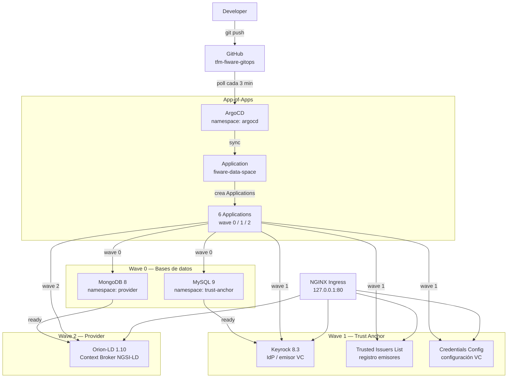

# Arquitectura del sistema

## Flujo GitOps



## Namespaces

| Namespace | Componentes | Descripcion |
|-----------|-------------|-------------|
| `argocd` | ArgoCD server, controller, repo-server, redis | Motor GitOps |
| `ingress-nginx` | NGINX ingress controller | Proxy de entrada (hostPort 80/443) |
| `trust-anchor` | Keyrock, TIL, CCS, MySQL | Identity Provider + registros VC |
| `provider` | Orion-LD, MongoDB | Context Broker NGSI-LD |

## Patron de secretos

```
AWS Secrets Manager (/fiware/*)
          |
  External Secrets Operator
  ClusterSecretStore + ExternalSecret
          |
          v
  K8s Secret: mysql-credentials
  K8s Secret: keyrock-credentials
  K8s Secret: mongodb-credentials
          |
  existingSecret: <nombre>   ← Helm values.yaml
```

## Sync Waves — orden de despliegue

```
Wave 0  MySQL, MongoDB           bases de datos
   |
   v (esperar Healthy)
Wave 1  Keyrock, TIL, CCS        trust anchor (dependen de MySQL)
   |
   v (esperar Healthy)
Wave 2  Orion-LD                 provider (depende de MongoDB)
```

## URLs AWS EKS (lab-jdmonsalvel.com)

| Servicio | URL |
|----------|-----|
| ArgoCD UI | https://argocd.lab-jdmonsalvel.com |
| Keyrock IdP | https://keyrock.lab-jdmonsalvel.com |
| Trusted Issuers List | https://til.lab-jdmonsalvel.com |
| Credentials Config Service | https://ccs.lab-jdmonsalvel.com |
| Orion-LD Context Broker | https://orion.lab-jdmonsalvel.com |

## Metricas objetivo

| Metrica | Objetivo |
|---------|----------|
| Deployment Lead Time (push a Healthy) | < 10 min |
| ArgoCD Sync Time | < 3 min |
| Configuration Drift Detection | < 60 seg |
| Smoke Test Pass Rate | 100% |
